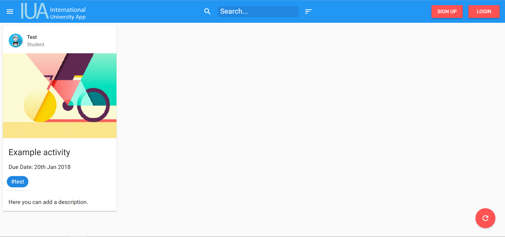
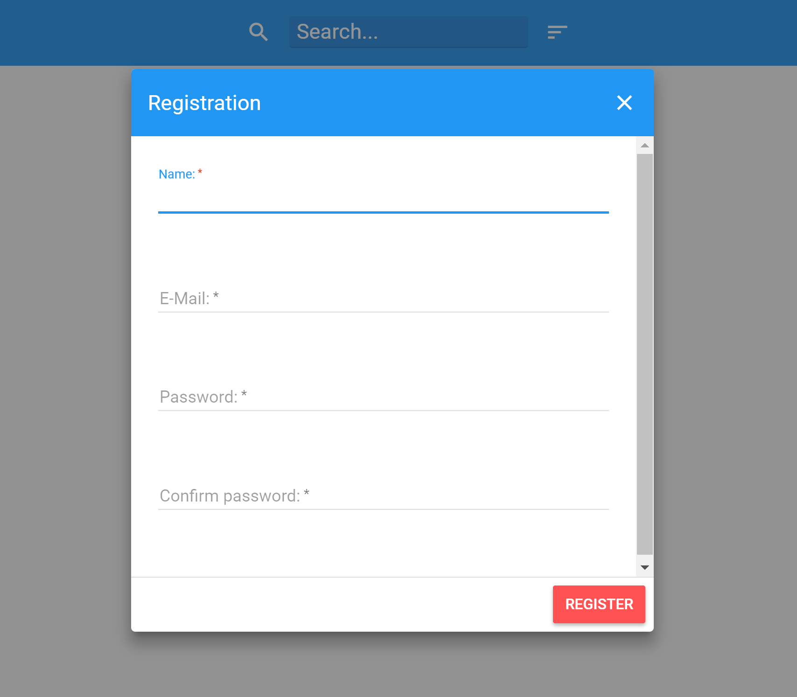
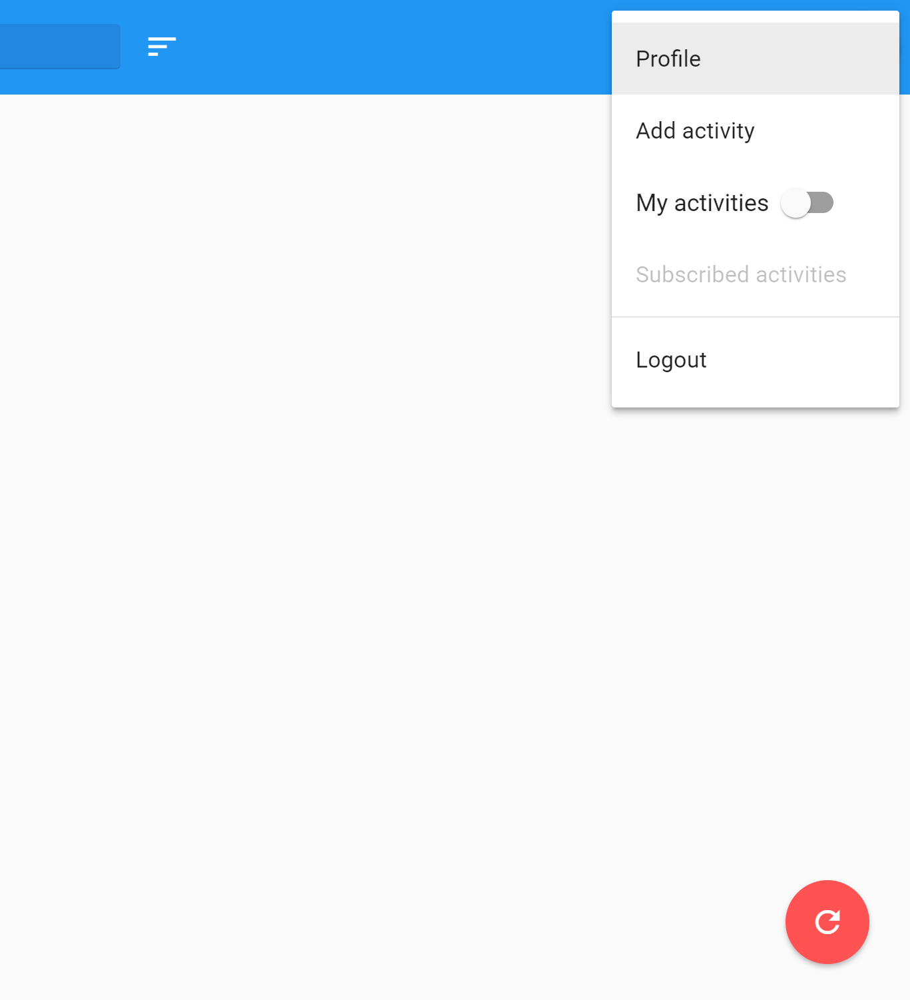
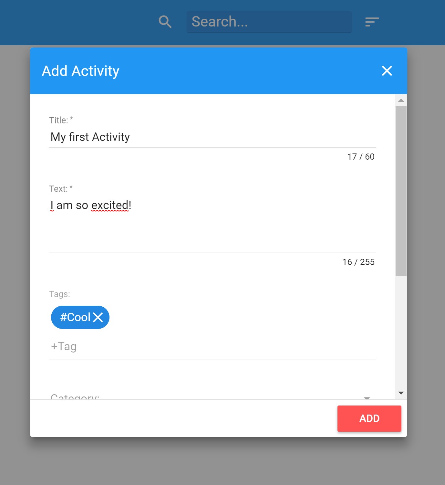
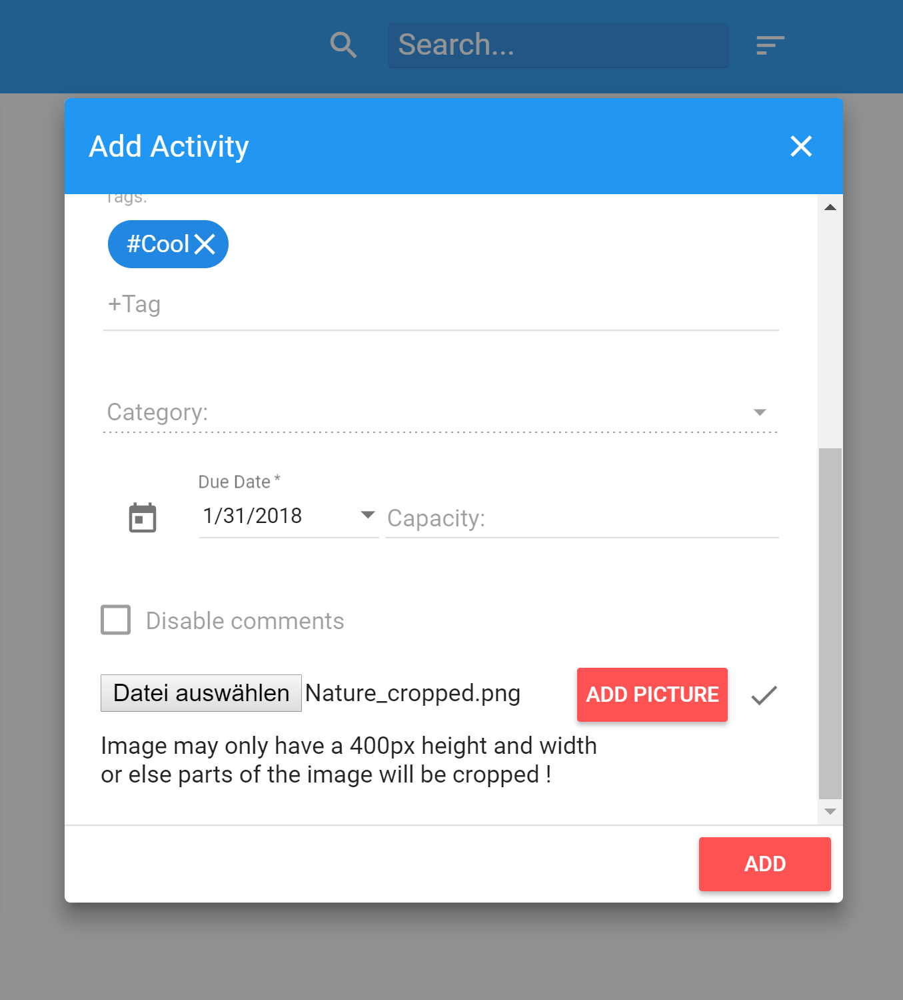
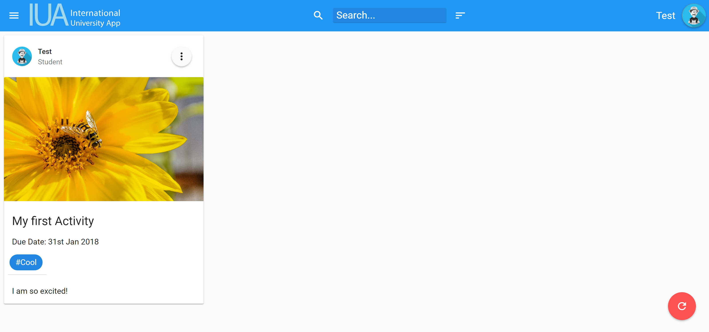

# IUA - International University App

## Structure
 * Linkings
 * Systemidea
 * Project introduction
 * How to create an activity

---

### Linkings

_Click here for:_

* [Project instruction](https://github.com/sweIhm/sweiproject-tg1b-4/blob/master/docs/ProjectProposal_ActivityMeter.pdf)

* [Basic example Project](https://github.com/sweIhm/sweiproject-example)

* [Wiki](https://github.com/sweIhm/sweiproject-tg1b-4/wiki)

* [Project repository](https://github.com/sweIhm/sweiproject-tg1b-4)

* [Mainsite](https://iua.herokuapp.com/)

* [Backend](backend.md)

---

## Sytemidea
**Feature List:**
* User Login
* Create Account
* Cal Poly and MUAS Newsfeed
* Activity Feed, anonymous 
* Ability to post activities with name, category, departments, Tags
* Get E-Mail to Post which you created
* Search function: sort after categories, by Tag, by time, etc...
* Contact button to find important people for every University
* Possibility to get access to specified groups
* Event maps and visualizations

**Requirements:**
* Javasprict-enabled browser (e.g. Smartphone)

---

Website

---

### Project introduction

An activity metering solution will give an easy visual overview on the collaborative activities at Cal Poly (California Polytechnic State University, San Luis Obispo) and MUAS (Munich University of Applied Sciences).

Persons involved in a collaborative activity (student exchange, faculty exchange, summer school participants, people (faculty, graduate students) interested in collaborating, etc.) can post their activity and interesting things about it. An activity has a name, a category, a department/college, and any number of tags (comparable to #tags in twitter) assigned with it. To post an activity, a person enters her/his Cal Poly or MUAS email address. A posting link is be sent to that email address. The posting can be composed after clicking on the posting link. The email address is only used for verification purposes. All information displayed will only contain anonymous information. Since the posting display is anonymous, privacy is guaranteed. Some monitoring will still be appropriate.

A key feature of the activity meter is the visualization of the activity information. Users can (without login) view (anonymized) activities and configure to view activities by category, by #tag, by department, by time interval etc. By selecting an activity, some details about the activity are displayed. The outcome of the activity meter is a variety of info graphics.

The overall goal of the activity meter is to visualize activities in the strategic partnership between Cal Poly and MUAS. People interested in collaborative projects can then directly contact their international office/department chairs/colleges. These authorities will refer interested persons to key contributors of a respective activity or group of activities. The activity meter displays areas of collaborative activities in form of maps or graphs. This can inspire people working in high-collaboration areas for more efforts or people in low-collaboration areas to expand activities to their departments or areas of interest. Overall, it will help both partner universities to get a better overview of potential synergies and collaborative opportunities.

The activity meter will be specified, designed, and implemented in teams in class projects in Software Engineering I (WS 2017/18). The implementation will use responsive web technologies to ensure cross platform availability of the application.

---

### How to create an activity

To registrate to our website you need to be a member of either MUAS or CalPoly! Simply click on the "registration" button in the upper right corner, write your username, your university e-mail, and a new password in the gaps and press "register":

A registrated and logged in user can create a activity-box by simply clicking on the "add activity" button above, write a title, a precise description of the activity and a tag in the appearing window and confirm it with "save":

The website should look similar to Twitter and shows every activity as a small box spread over the whole website.
Here is your first activity:

Well done!
